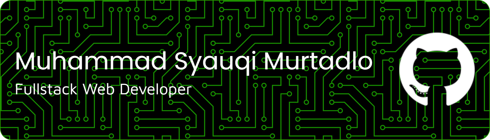

  

# Hello, I'm Muhammad Syauqi Murtadlo 👋☺️

<!--
**MuhammadSyauqiMurtadlo/MuhammadSyauqiMurtadlo** is a ✨ _special_ ✨ repository because its `README.md` (this file) appears on your GitHub profile.

Here are some ideas to get you started:

- 🔭 I’m currently working on ...
- 🌱 I’m currently learning ...
- 👯 I’m looking to collaborate on ...
- 🤔 I’m looking for help with ...
- 💬 Ask me about ...
- 📫 How to reach me: ...
- 😄 Pronouns: ...
- ⚡ Fun fact: ...
-->

- 💻 Fullstack Web Developer passionate about building web applications that are useful, scalable, and easy to use.
- 🌱 Currently growing my expertise in Laravel, PHP, JavaScript, databases, and modern web technologies.
- 🚀 I enjoy turning ideas into real applications, solving problems through code, and continuously improving my technical skills.
- 🤖 Interested in Web Development, Artificial Intelligence, and technology that creates meaningful impact.
- 📚 Believer in lifelong learning — always exploring, building, and growing one step at a time.
- 🤝 Open to collaboration, learning opportunities, and connecting with fellow developers.
- 📫 Let's connect on LinkedIn!

<!-- ### Languages and Tools:

<!--  -->

<!-- ### Social Media

<!--  -->

<h2 align="center">Languages and Tools</h2>

  
  
  
  
  
  
  
  
  
  
  
  
  
  
  
  
  
  
  
  
  
  
  
  
  
  
  
  
  
  
  
  
  

<h2 align="center">AI Tools & Assistants</h2>

  
  
  
  

<h2 align="center">Connect With Me</h2>

  

  

  

  

<h2 align="center">GitHub Stats</h2>

  
  

<h2 align="left">Play games with me</h2>

  

