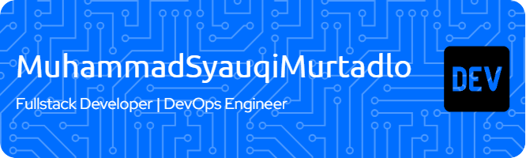

# Hi there, I am Muhammad Syauqi Murtadlo 👋☺️

<!--
**MuhammadSyauqiMurtadlo/MuhammadSyauqiMurtadlo** is a ✨ _special_ ✨ repository because its `README.md` (this file) appears on your GitHub profile.

Here are some ideas to get you started:

- 🔭 I’m currently working on ...
- 🌱 I’m currently learning ...
- 👯 I’m looking to collaborate on ...
- 🤔 I’m looking for help with ...
- 💬 Ask me about ...
- 📫 How to reach me: ...
- 😄 Pronouns: ...
- ⚡ Fun fact: ...
-->

## I'm a Fullstack Web Developer and a DevOps Engineer!!❤️

- 🔭 I’m currently working on a project that involves **Machine Learning** and **Blockchain**.
- 🌱 I’m currently learning about [**Framework Laravel**](https://laravel.com)
- 👯 I’m looking to collaborate on open-source projects related to data science and machine learning.

  > _- 🤔 I’m looking for help with advanced machine learning algorithms and techniques._

- 📫 How to reach me: [LinkedIn](https://www.linkedin.com/in/muhammad-syauqi-murtadlo-043138276/)
- 😄 Pronouns: _He/Him_
- ⚡ Fun fact: I love to play chess and read books on technology and science.

### Languages and Tools:

<!--  -->

### Social Media

<!--  -->

### Cryptocurrency

